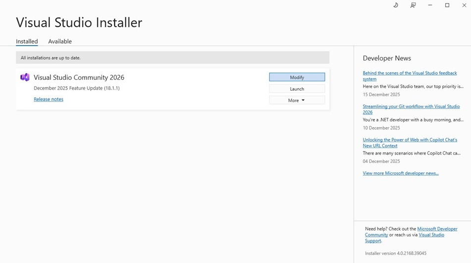
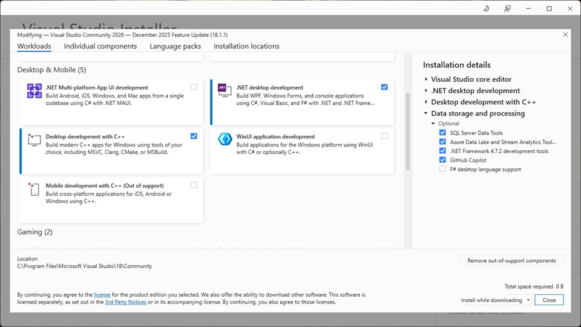
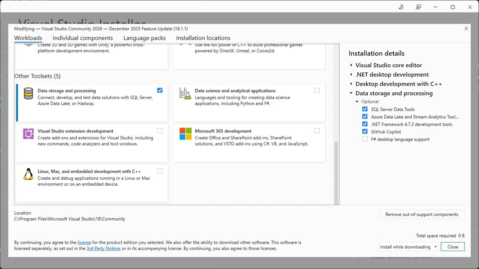
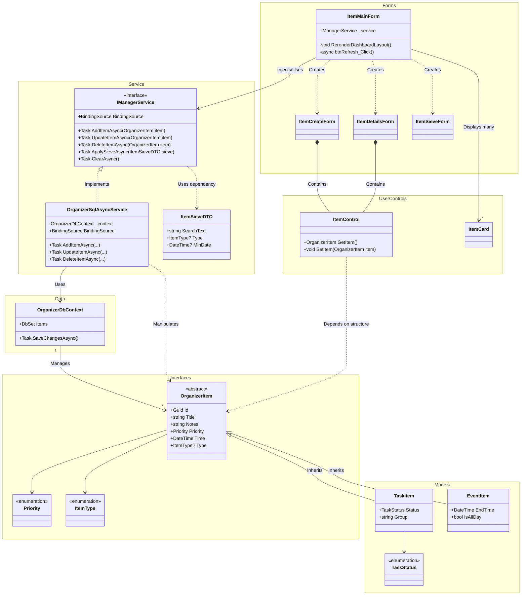

# Organizer WinForms Project (Async & SQL)

A desktop organizer application built with C# and WinForms, featuring asynchronous database operations and a robust filtering system. 
This project is architected to be as cross-platform friendly as possible by decoupling business logic from the UI.

## Features

- **Asynchronous CRUD:** All database operations (Create, Read, Update, Delete) are non-blocking to keep the UI responsive.
- **Dual Item Types:** Support for both Tasks (with status/overdue logic) and Events (with start/end times).
- **Advanced Filtering (Sieve):** Filter and sort your dashboard by text, priority, type, and dates using a lazy-evaluated LINQ query.
- **SQL Persistence:** Uses Entity Framework 6 (Code First) with a Table-per-Hierarchy (TPH) mapping.

## Prerequisites
- Visual Studio 2022 or higher
- .NET Framework 4.7.2 SDK
- SQL Server Express LocalDB  

*Visual Studio Installer*  

*.NET desktop workload*  

*SQL Server workload*  


## Getting Started
Follow these steps to launch the project:

### 1. Initial Setup
- Clone the repository.
- Open OrganizerProject.sln in Visual Studio.
- Restore NuGet Packages:
	- Right-click the Solution
	- Select "Restore NuGet Packages" (this installs Entity Framework 6.5.1).

### 2. Database Configuration
The app is configured to use LocalDB. If you need to change the server instance, update the connection string in `App.config`:
```xml
<connectionStrings>
    <add name="OrganizerDb" 
         connectionString="Server=(localdb)\ProjectModels;Database=OrganizerDatabase;Trusted_Connection=True;" 
         providerName="System.Data.SqlClient" />
</connectionStrings>
```

### 3. Initialize the Database
Open the Package Manager Console (Tools > NuGet Package Manager) and run:
```powershell
Update-Database
```

### 4. Run the App
Press `F5` to Run in Debug Mode. Or click green 'play' button in Visual Studio.  
*Note: To launch qpp faster press `Shift + F5` to run without Debug Mode.*

## Developer Notes
- **Constructors:** All items are automatically assigned a new `Guid` and default `DateTime.Today` upon creation to prevent SQL MinDate crashes.  
- **Async Logic:** When calling service methods, always `await` them in `async void` event handlers to ensure the `RerenderDashboardLayout()` call waits for the database to finish.  
- **Cleanup:** If you want to start with a fresh database, use the `ClearAsync()` method in the service or manually delete the `.mdf` file in your build directory.  

## UML Diagram

